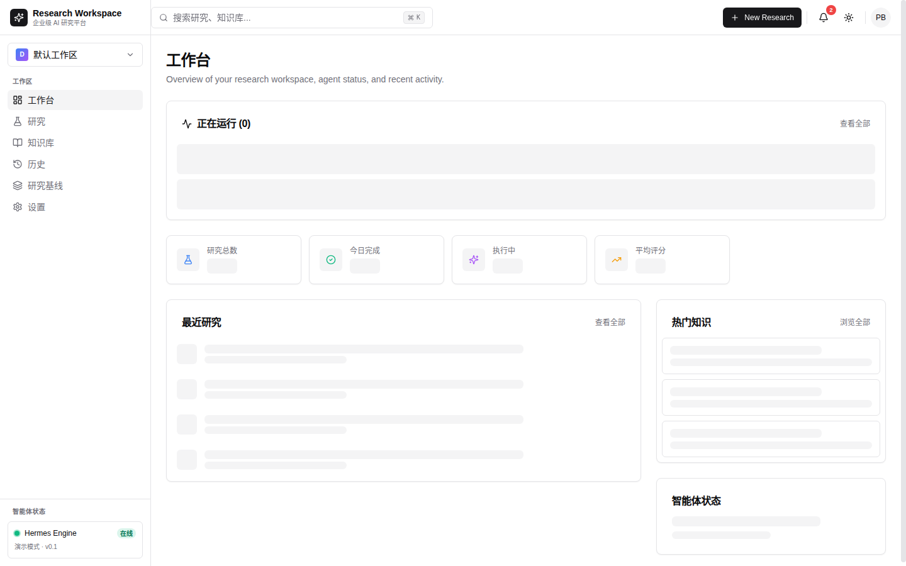
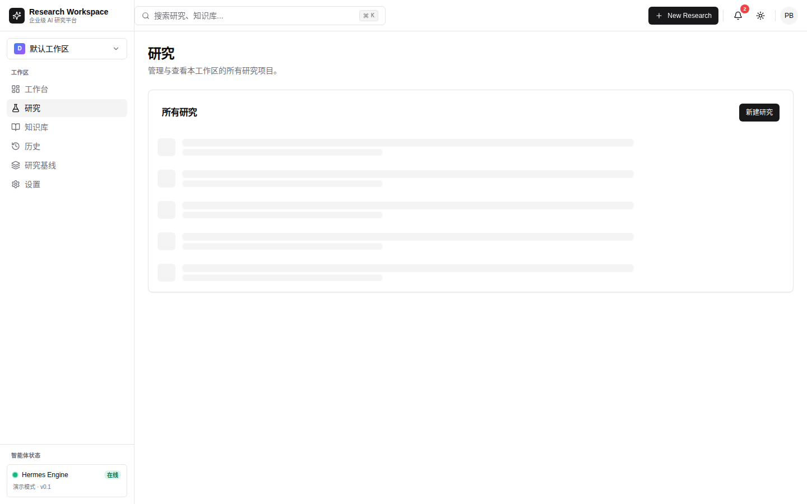
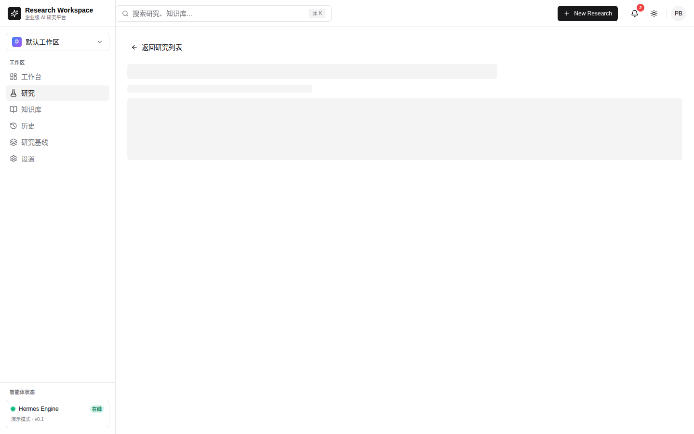
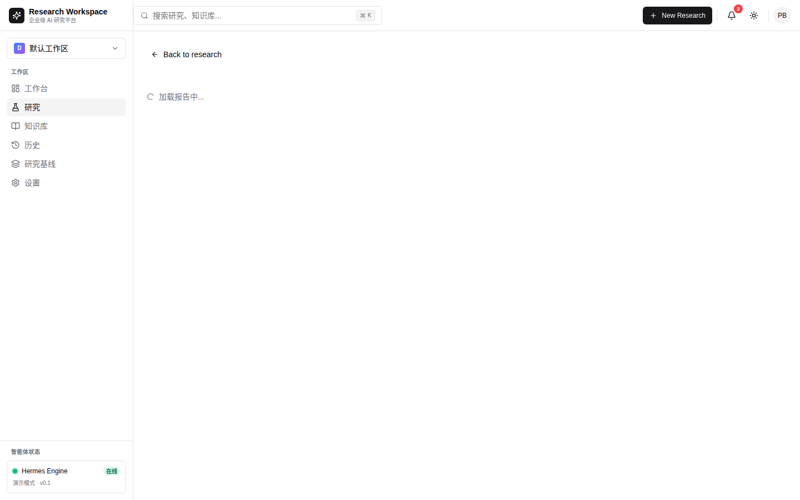
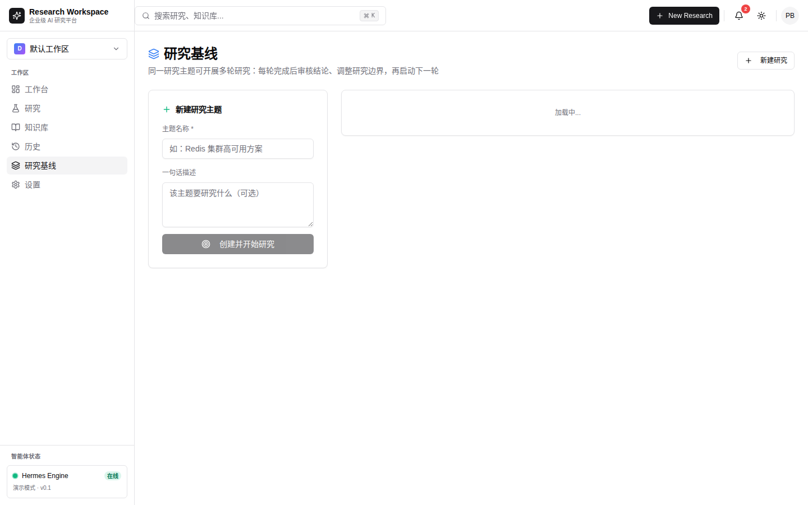
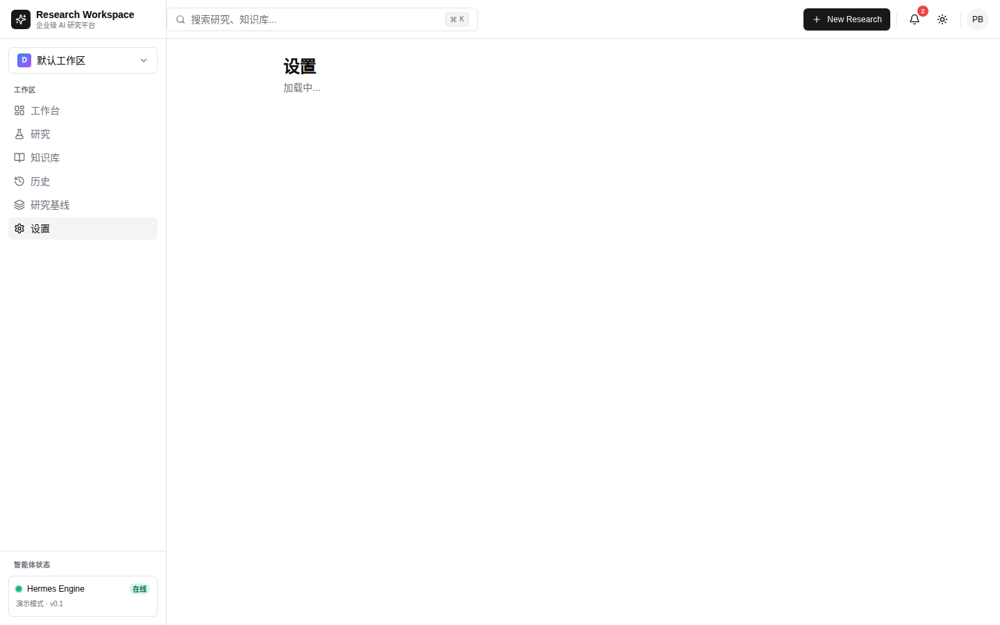

# AI Research Workspace

**AI 预研工作台** — 企业级 AI 驱动的预研平台，将研究目标自动转化为结构化报告与实证验证。

## 项目意义

在技术选型和架构决策过程中，团队通常需要：
1. **调研**：阅读大量文档、论文、技术博客
2. **分析**：对比不同方案的优劣
3. **验证**：在真实环境中测试关键假设
4. **报告**：将结论整理为可汇报的文档

这个过程耗时数天到数周，且高度依赖个人经验。**AI Research Workspace** 将这四个阶段自动化：

```
用户输入研究目标 → AI 自动调研 → 自动分析对比 → 自动 K8s 环境验证 → 生成结构化报告
```

### 核心价值

| 传统方式 | AI Research Workspace |
|----------|----------------------|
| 人工搜索 + 阅读文档（2-3天） | AI 自动调研 + 实时搜索（5-10分钟） |
| 手动对比分析（1天） | 自动生成对比矩阵 + 评分 |
| 搭建测试环境（1-2天） | 自动部署 K8s 工作负载 + 验证 |
| 撰写报告（半天） | 自动生成 12 节结构化报告 |
| **总计 4-6 天** | **总计 15-30 分钟** |

---

## 产品截图

### 仪表盘


### 研究列表


### 研究详情


### 执行视图


### 研究报告


### 研究主题


### 系统设置


---

## 系统架构

```
┌─────────────────────────────────────────────────────────────────┐
│                        Frontend (Next.js 15)                     │
│  ┌──────────┐ ┌──────────┐ ┌──────────┐ ┌──────────┐ ┌────────┐ │
│  │ Dashboard │ │ Research │ │ Execute  │ │ Report   │ │ Topics │ │
│  └──────────┘ └──────────┘ └──────────┘ └──────────┘ └────────┘ │
└─────────────────────────────┬───────────────────────────────────┘
                              │ SSE + REST
┌─────────────────────────────┴───────────────────────────────────┐
│                        Backend (FastAPI)                          │
│  ┌─────────────────────────────────────────────────────────────┐ │
│  │                    Agent Layer (可插拔)                       │ │
│  │  ┌─────────┐ ┌──────────┐ ┌──────────────┐ ┌────────────┐ │ │
│  │  │  Mock   │ │ Stepfun  │ │   Hermes     │ │  K8s 实验   │ │ │
│  │  │ Agent   │ │  Agent   │ │  Researcher  │ │   引擎     │ │ │
│  │  └─────────┘ └──────────┘ └──────────────┘ └────────────┘ │ │
│  └─────────────────────────────────────────────────────────────┘ │
│  ┌──────────┐ ┌──────────┐ ┌──────────┐ ┌──────────┐ ┌────────┐ │
│  │ Research │ │ Knowledge│ │  Topics  │ │  History │ │  Tags  │ │
│  │ Service  │ │ Service  │ │ Service  │ │ Service  │ │Service │ │
│  └──────────┘ └──────────┘ └──────────┘ └──────────┘ └────────┘ │
└─────────────────────────────┬───────────────────────────────────┘
                              │
┌─────────────────────────────┴───────────────────────────────────┐
│                    数据层 (SQLite + SQLAlchemy)                    │
│  ┌──────────┐ ┌──────────┐ ┌──────────┐ ┌──────────┐ ┌────────┐ │
│  │researches│ │ artifacts│ │ reviews  │ │ topics   │ │ k8s    │ │
│  │  tasks   │ │timeline_e│ │versions  │ │ iterations│ │clusters│ │
│  └──────────┘ └──────────┘ └──────────┘ └──────────┘ └────────┘ │
└─────────────────────────────────────────────────────────────────┘
                              │
┌─────────────────────────────┴───────────────────────────────────┐
│                    K8s 集群 (验证层)                               │
│  ┌──────────┐ ┌──────────┐ ┌──────────┐ ┌──────────┐           │
│  │  MySQL   │ │  Redis   │ │ Postgres │ │  MongoDB │  ...      │
│  │  主从    │ │  缓存    │ │  集群    │ │  副本集  │           │
│  └──────────┘ └──────────┘ └──────────┘ └──────────┘           │
└─────────────────────────────────────────────────────────────────┘
```

---

## 核心功能

### 1. 研究生命周期管理

```
创建研究 → 生成计划 → 执行调研 → K8s 验证 → 生成报告 → AI 评审
    │          │          │          │          │          │
    └──────────┴──────────┴──────────┴──────────┴──────────┘
                    全程 SSE 实时推送
```

- **研究创建**：支持模板、AI 扩展目标、标签分类
- **执行视图**：三栏布局（任务树 | 时间线 | 产物），实时流式更新
- **报告生成**：12 节结构化 Markdown，含对比矩阵、雷达图
- **版本历史**：Git 风格的快照、差异对比、分支、回滚

### 2. 多 Agent 架构

| Agent | 用途 | 特点 |
|-------|------|------|
| `MockAgentClient` | 演示/开发 | 4 秒确定性流程，无需 LLM |
| `StepfunAgentClient` | 生产环境 | 5 阶段 LLM 流水线 + 网络搜索 |
| `HermesResearcherAgent` | 生产环境 | 本地 CLI + 研究员 Profile + 14 维评审 |

### 3. K8s 实验引擎（核心亮点）

**两种验证模式**：

#### 3.1 固定模板验证
- 预定义的工作负载模板（MySQL/Redis/Postgres/MongoDB/Nginx）
- 关键词自动匹配研究目标
- 适合快速验证

#### 3.2 LLM 驱动实验（新）
- **Agent 决定**：部署什么工作负载、执行什么命令、验证什么断言
- **自动补全**：缺失的工作负载自动生成（MySQL/Redis/Postgres/MongoDB/BusyBox）
- **智能检查**：pod_ready / service_ready / pod_log_match / http_ok
- **实时流式**：Pod 状态、容器命令、日志尾部实时推送

```
LLM 生成实验计划 → 自动补全缺失 workload → 应用到 K8s 集群 → 执行检查 → 生成实证报告
        ↓                    ↓                    ↓              ↓
   workloads[]         ConfigMap 挂载        镜像自动同步      结果持久化
   checks[]            readinessProbe       命名空间隔离      实证数据注入
```

### 4. 知识库与风格迁移

- **文档上传**：支持 Markdown 文档，自动解析章节
- **风格提取**：LLM 分析文档风格（语气、长度、量化偏好）
- **风格匹配**：根据研究目标自动选择最匹配的写作风格
- **实证注入**：K8s 验证结果自动注入报告的"实证数据"章节

### 5. 研究主题（迭代基线）

- **主题管理**：将多次迭代归入同一主题
- **基线对比**：首轮作为基线，后续迭代计算 delta
- **分数趋势**：可视化每轮分数变化
- **AI 生成计划**：首轮自动研究计划

---

## 技术栈

### 前端
| 技术 | 用途 |
|------|------|
| Next.js 15 (App Router) | React 框架 |
| TypeScript | 类型安全 |
| Tailwind CSS | 原子化样式 |
| shadcn/ui (Radix) | UI 组件库 |
| Zustand | 状态管理 |
| TanStack Query | 数据请求 + 缓存 |
| Mermaid | 流程图渲染 |
| next-themes | 暗色模式 |

### 后端
| 技术 | 用途 |
|------|------|
| FastAPI | 异步 Web 框架 |
| SQLAlchemy (async) | ORM |
| aiosqlite | SQLite 异步驱动 |
| Pydantic v2 | 数据验证 |
| httpx | 异步 HTTP 客户端 |
| pydantic-settings | 配置管理 |

### 基础设施
| 技术 | 用途 |
|------|------|
| Kubernetes | 验证环境 |
| Harbor | 私有镜像仓库 |
| Hermes | 本地 LLM CLI |
| Stepfun API | 云端 LLM |
| MiniMax | 网络搜索 |

---

## 项目结构

```
ai-research-workspace/
├── frontend/                          # Next.js 15 前端
│   ├── app/                           # App Router 路由
│   │   ├── dashboard/page.tsx         # 仪表盘
│   │   ├── research/                  # 研究管理
│   │   │   ├── new/page.tsx           # 新建研究
│   │   │   ├── [id]/page.tsx          # 研究详情
│   │   │   ├── [id]/execute/page.tsx  # 执行视图（三栏）
│   │   │   └── [id]/report/page.tsx   # 报告视图
│   │   ├── topics/                    # 研究主题
│   │   ├── knowledge/                 # 知识库
│   │   ├── history/                   # 版本历史
│   │   └── settings/page.tsx          # 设置
│   ├── features/                      # 功能模块（按特性组织）
│   │   ├── research/                  # 研究核心
│   │   │   ├── hooks*.ts              # 数据钩子
│   │   │   ├── api*.ts                # API 客户端
│   │   │   └── components/            # UI 组件
│   │   ├── dashboard/                 # 仪表盘
│   │   ├── knowledge/                 # 知识库
│   │   ├── topics/                    # 主题
│   │   └── settings/                  # 设置
│   ├── components/                    # 共享组件
│   └── lib/                           # 工具函数、类型
│
├── backend/                           # FastAPI 后端
│   ├── app/
│   │   ├── agents/                    # Agent 系统（核心）
│   │   │   ├── base.py               # AgentClient 接口
│   │   │   ├── mock.py               # Mock Agent
│   │   │   ├── stepfun.py            # Stepfun Agent
│   │   │   ├── hermes_researcher.py  # Hermes Agent
│   │   │   ├── k8s_experiment.py     # K8s 实验引擎
│   │   │   ├── k8s_workload.py       # 工作负载模板
│   │   │   ├── k8s_image.py          # 镜像同步
│   │   │   └── k8s_cleanup.py        # 资源清理
│   │   ├── api/v1/                    # API 路由
│   │   ├── core/                      # 配置、加密、缓存
│   │   ├── db/                        # 数据库模型（14 张表）
│   │   ├── schemas/                   # Pydantic 模型
│   │   └── services/                  # 业务逻辑
│   ├── tests/                         # 测试套件
│   └── storage/                       # SQLite + 产物
│
└── docs/                              # 文档
```

---

## 快速开始

### 环境要求
- Python 3.11+
- Node.js 20+
- K8s 集群（可选，用于验证）

### 后端启动

```bash
cd backend

# 创建虚拟环境
python -m venv .venv
source .venv/bin/activate

# 安装依赖
pip install -r requirements.txt

# 配置环境变量
cp .env.example .env
# 编辑 .env 填入 API Key

# 启动服务
uvicorn app.main:app --port 8003 --reload
```

验证：`curl http://127.0.0.1:8003/health`

### 前端启动

```bash
cd frontend

# 安装依赖
npm install

# 启动开发服务器
npm run dev -p 3000
```

访问：http://localhost:3000

---

## 配置

### 环境变量

| 变量 | 默认值 | 说明 |
|------|--------|------|
| `AIRW_AGENT_MODE` | `mock` | Agent 模式：mock / llm / hermes-researcher |
| `AIRW_DB_PATH` | `storage/airw.db` | SQLite 数据库路径 |
| `AIRW_STEPFUN_API_KEY` | - | LLM API Key |
| `AIRW_STEPFUN_MODEL` | `step-3.7-flash` | LLM 模型 |
| `AIRW_STEPFUN_BASE_URL` | - | LLM API 地址 |
| `AIRW_HERMES_BIN` | `/root/.local/bin/hermes` | Hermes CLI 路径 |
| `AIRW_ENCRYPTION_KEY` | - | Fernet 加密密钥 |

### K8s 配置

通过 API 或设置页面配置 K8s 集群：
- API 地址
- Bearer Token（加密存储）
- CA 证书
- 默认命名空间

---

## API 文档

启动后端后访问：`http://127.0.0.1:8003/docs`

### 核心端点

| 方法 | 路径 | 说明 |
|------|------|------|
| `POST` | `/api/v1/researches` | 创建研究 |
| `POST` | `/api/v1/researches/{id}/start` | 启动执行 |
| `GET` | `/api/v1/researches/{id}/stream` | SSE 实时流 |
| `GET` | `/api/v1/researches/{id}/report` | 获取报告 |
| `GET` | `/api/v1/topics` | 研究主题列表 |
| `POST` | `/api/v1/topics/{id}/iterate` | 迭代研究 |
| `GET` | `/api/v1/dashboard` | 仪表盘数据 |
| `POST` | `/api/v1/knowledge/uploads` | 上传知识文档 |

---

## 数据库

14 张表覆盖完整研究生命周期：

| 表 | 用途 |
|----|------|
| `researches` | 研究主体 |
| `tasks` | 任务树 |
| `timeline_events` | 实时事件 |
| `artifacts` | 产物（报告/k8s验证/实验） |
| `reviews` | AI 评审 |
| `research_versions` | 版本快照 |
| `research_topics` | 研究主题 |
| `k8s_clusters` | K8s 集群配置（加密） |
| `knowledge_documents` | 知识文档 |
| `knowledge_styles` | 写作风格 |
| `tags` / `research_tags` | 标签系统 |
| `app_config` | 运行时配置 |
| `research_resources` | K8s 资源跟踪 |

---

## K8s 实验引擎详解

### 工作流程

```
1. 接收研究目标
   ↓
2. 调用 LLM（hermes k8s-expert 或 Stepfun）生成实验计划
   ↓
3. 验证计划一致性
   - 检查 check target 是否有对应 workload
   - 自动补全缺失的 workload（MySQL/Redis/Postgres/MongoDB/BusyBox）
   - 自动挂载 ConfigMap
   ↓
4. 应用工作负载
   - 镜像自动同步到 Harbor
   - 自动修复 YAML（补全 resources/readinessProbe）
   - 失败 workload 自动跳过
   ↓
5. 执行检查
   - pod_ready: Pod 是否就绪
   - service_ready: Service 端点是否可用
   - pod_log_match: 日志是否包含预期字符串
   - http_ok: HTTP 端点是否返回 200
   ↓
6. 生成实证报告
   - 工作负载列表 + 容器命令
   - 检查结果 + 通过/失败原因
   - 中文解释的验证点
```

### 自动补全规则

| 检测到的关键词 | 自动生成的 workload | readinessProbe |
|---------------|---------------------|----------------|
| mysql | MySQL 8.0 Deployment + Service | `mysqladmin ping` |
| redis | Redis 7.0.4 Deployment + Service | `redis-cli ping` |
| postgres | PostgreSQL 15 Deployment + Service | `pg_isready` |
| mongo | MongoDB 8.0 Deployment + Service | `mongosh --eval db.adminCommand('ping')` |
| 其他 | BusyBox Deployment | 无 |

---

## 开发指南

### 运行测试

```bash
cd backend
AIRW_DB_PATH=storage/airw_test.db python -m pytest tests/ -v
```

### 代码规范
- 后端：Python 类型提示，异步优先
- 前端：TypeScript 严格模式，函数组件
- 提交：Conventional Commits（feat/fix/docs/chore）

### 添加新 Agent

1. 继承 `AgentClient`（`backend/app/agents/base.py`）
2. 实现 `run_research()` 方法
3. 在 `backend/app/agents/__init__.py` 注册
4. 通过 `AIRW_AGENT_MODE` 环境变量切换

---

## 部署

### 生产环境

```bash
# 后端
cd backend
uvicorn app.main:app --host 0.0.0.0 --port 8003 --workers 4

# 前端
cd frontend
npm run build
npm run start
```

### Systemd 服务

```ini
[Unit]
Description=AIRW Backend
After=network.target

[Service]
Type=simple
ExecStart=/opt/airw/venv/bin/uvicorn app.main:app --host 127.0.0.1 --port 8003
Restart=always
RestartSec=5

[Install]
WantedBy=multi-user.target
```

---

## License

MIT
